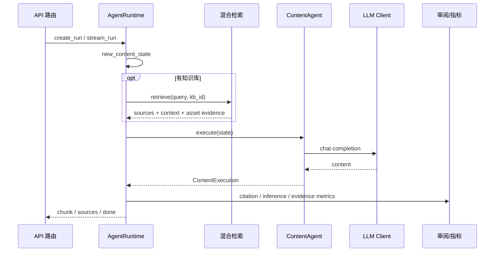

# Agent 设计

## 设计方向

当前项目的 Agent 设计遵循“少而清晰”的方向：保留高价值工作流边界，把检索、提示词、渲染、知识库访问、验证和运行指标沉到共享能力层。这样可以避免多个 Agent 类重复处理状态、证据和 LLM 调用。

## 核心对象

| 对象 | 文件 | 职责 |
|---|---|---|
| `RuntimeState` | `src/agent_runtime/state.py` | 当前主 typed state，记录用户任务、控制状态、诊断信息和内容状态。 |
| `RuntimeControl` | `src/agent_runtime/state.py` | 控制运行模式、当前阶段、检索轮次、修复次数和停止原因。 |
| `ContentState` | `src/agent_runtime/state.py` | 聊天和写作任务的输入、历史、证据、上下文、技能指令和输出。 |
| `AgentRuntime` | `src/agent_runtime/runtime.py` | 创建 run、执行同步/流式任务、检索证据、调用内容工作流、写入指标。 |
| `ContentAgent` | `src/agent_workflows/content/content_agent.py` | 根据 mode 构造 prompt，调用 LLM，支持 chat/rewrite/expand/shorten/polish。 |
| `RunStore` | `src/agent_runtime/store.py` | 管理短期 run 记录、trace id、状态和结果。 |

## 运行阶段

当前 runtime 的阶段命名保留了可扩展空间：

| 阶段 | 当前用途 |
|---|---|
| `planning` | 初始化任务和状态，当前内容链路中是轻量阶段。 |
| `searching` | 当任务携带知识库时进行证据检索。 |
| `content_generation` | 构造 prompt 并调用 LLM 生成内容。 |
| `reviewing` | 检查引用覆盖率、推理比例和缺证据情况。 |
| `complete` / `failed` | 标记运行结束状态。 |

## 内容工作流

## Agent 类型现状

| Agent | 当前状态 |
|---|---|
| Chat Agent | 对外 import path 保留，内部通过兼容适配器接入统一内容链路。 |
| Co-Writer Agent | 对外 import path 保留，内部通过兼容适配器接入统一内容链路。 |
| Content Agent | 当前实际承接聊天与协同写作的核心 Agent。 |
| Planning/Search/Report/Review | 作为规范上的 canonical workflow agent 边界保留，后续应在统一 runtime 下补回，而不是恢复多套平行状态。 |

## 共享能力

| 能力 | 目录 | 说明 |
|---|---|---|
| LLM 调用 | `src/shared_capabilities/llm` | 统一 chat completion 和 stream completion。 |
| Prompt 加载 | `src/shared_capabilities/prompts` | 从 agent prompt 文件加载中文 prompt。 |
| 知识证据 | `src/shared_capabilities/knowledge` | 归一化论文来源、补充图表证据。 |
| 检索后端 | `src/shared_capabilities/retrieval` | 从知识库构建检索后端。 |
| 渲染 | `src/shared_capabilities/rendering` | 绑定段落证据、添加推理标记。 |
| 校验 | `src/shared_capabilities/traceability` | 面向证据 id、报告和审阅问题的校验入口。 |

## 证据与验证原则

- 有来源时，回答段落应尽量绑定引用。
- 没有来源时，输出要显式标记为推理，避免把模型猜测包装成事实。
- 图表资产作为证据补充进入来源列表，而不是只作为前端展示附件。
- run 级指标记录检索、生成、审阅、引用覆盖和模型调用信息。
- 兼容适配器只负责旧接口过渡，不应重新拥有完整工作流边界。

## 后续收敛建议

1. 将 planning/search/report/review 重新实现为统一 runtime 下的清晰 workflow agent，而不是恢复旧目录中的并行状态模型。
2. 修复历史校验模块中仍引用旧报告类型的部分，让校验能力与当前 `RuntimeState` 对齐。
3. 将 Notebook 数据目录和迁移脚本继续收敛，减少运行数据的双轨世界。
4. 为技能注册补回少量高价值技能，并保证每个技能都有明确输入、证据要求和失败行为。
