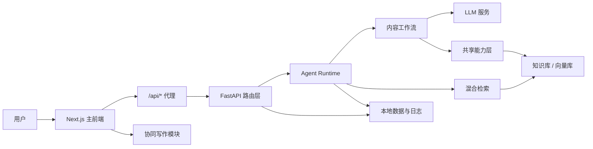

# 项目架构

## 总览

WritingBot 当前采用“主站 + 后端 API + 统一 Agent Runtime + RAG 能力层 + 本地数据”的结构。系统的核心不是堆叠多个独立 Agent，而是把规划、检索、生成、审阅、渲染、证据绑定和评估逐步收敛到共享运行时和共享能力中。

## 目录职责

| 目录 | 职责 |
|---|---|
| `src/api` | FastAPI 应用、CORS、健康检查和业务路由注册。 |
| `src/api/routers` | 知识库、聊天、笔记本、协同写作、检索、编排、评估、设置、技能等接口。 |
| `src/agent_runtime` | 统一运行时、typed state、事件、运行存储和校验入口。 |
| `src/agent_workflows/content` | 内容生成工作流，承接聊天与写作类任务。 |
| `src/agents` | 对外保留的 Agent import path，目前主要作为兼容入口。 |
| `src/compat` | 历史接口适配，避免上层调用立即断裂。 |
| `src/retrieval` | 混合检索、索引访问和 token 估算。 |
| `src/rag` | RAG pipeline、retriever、reranker、context builder、generator。 |
| `src/knowledge` | 知识库实体、向量存储、PDF 图表资产。 |
| `src/shared_capabilities` | LLM 调用、prompt 加载、证据处理、报告渲染、检索后端、可追溯校验。 |
| `src/services` | 配置、LLM client、Notebook service、Prompt manager。 |
| `web` | 主站 UI、页面路由、API proxy、组件和前端状态。 |
| `config` | 主配置、Agent 配置和技能配置。 |
| `data` | 本地知识库、会话、指标、评估、上传和笔记数据。 |
| `tests` | 后端回归测试和 API smoke 测试。 |

## 主运行链路

### 智能问答

1. 用户在 `web/src/app/chat/page.tsx` 发起问题。
2. 前端通过 `/api/chat` 或 `/api/chat/stream` 请求后端。
3. 路由层处理会话、限流、流式事件和错误输出。
4. Agent Runtime 创建 run，准备 typed state。
5. 检索层从目标知识库召回文本证据和图表证据。
6. 内容工作流构造 prompt，调用 LLM。
7. 渲染能力将段落与引用绑定；缺证据内容标记为推理。
8. 运行指标、来源和最终输出回传前端并写入本地记录。

### 协同写作

1. 用户从主站进入协同写作页面。
2. 编辑器负责 LaTeX 论文编辑体验。
3. 写作请求通过后端写作接口获取证据、改写、扩写、缩写或润色结果。
4. 后端继续复用 Agent Runtime、检索能力、LLM 能力和证据输出规则。

### 笔记本

1. 用户创建 Notebook，导入来源或关联知识库内容。
2. 后端管理来源、笔记、工作区输出、事件流和洞察接口。
3. 前端通过专门的 workspace store 管理列状态、笔记编辑状态和工作区 UI。

## 数据边界

| 数据 | 位置 | 说明 |
|---|---|---|
| 知识库 | `data/knowledge_bases` | PDF 文本、chunk、向量索引、资产索引。 |
| 会话 | `data/sessions` | 聊天历史 JSONL。 |
| Notebook | `data/notebooklm` / `data/notebooks` | 当前存在迁移痕迹，后续需要继续收敛。 |
| 指标 | `data/metrics` | Agent run JSONL 和运行摘要。 |
| 评估 | `data/evaluation` | 评估任务与报告。 |
| 上传 | `data/uploads` | 用户上传文件暂存。 |

## 当前架构状态

- 主链路已经从“多个重叠研究 Agent”转向“统一 runtime + 内容工作流 + 兼容适配器”。
- 历史研究页和研究专用路由已从当前主站路径中移除。
- 共享能力层已经承接检索、prompt、渲染、证据和校验，但个别历史校验类型仍需要跟 typed state 继续对齐。
- Notebook 数据目录存在新旧命名并存，后续应继续做迁移和清理。
- 协同写作模块已作为项目内独立模块接入，但文档和 UI 应保持“项目能力”口径。
