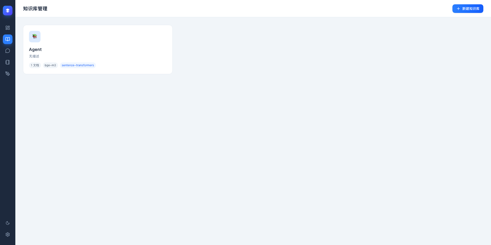
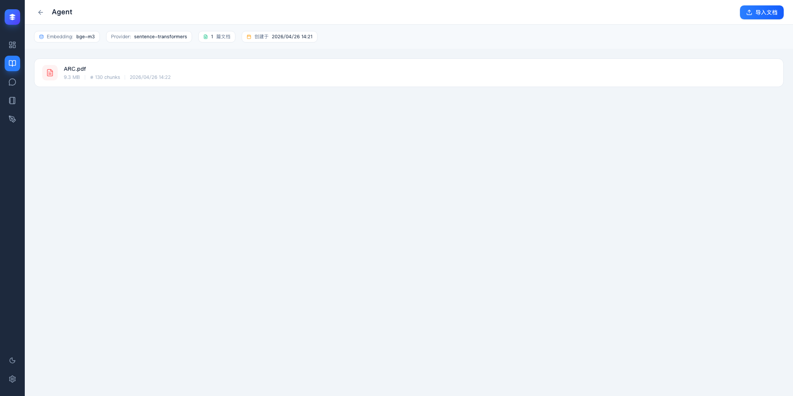
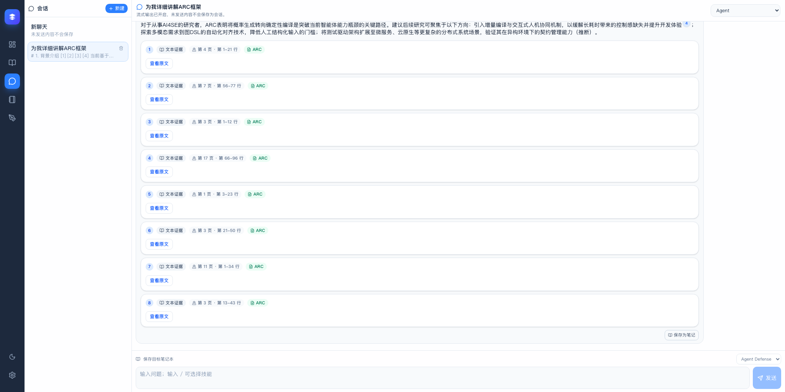
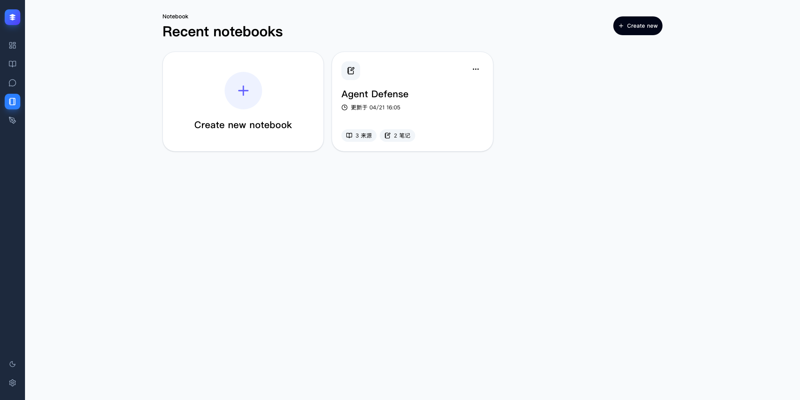
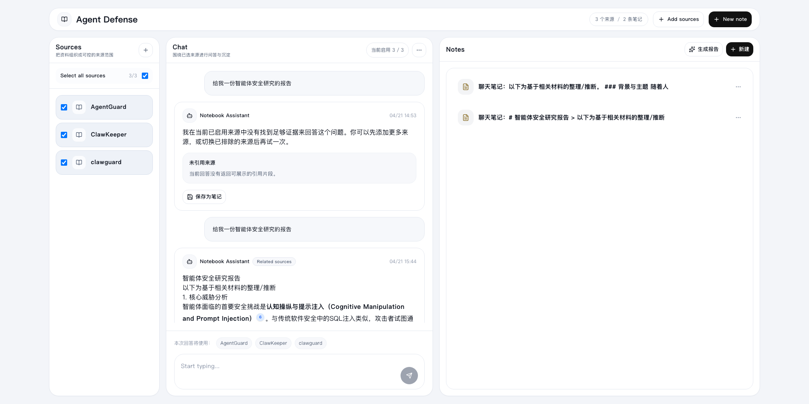
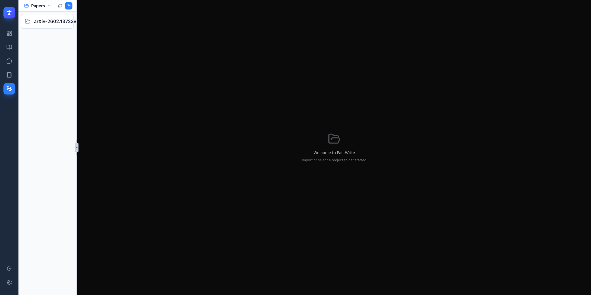
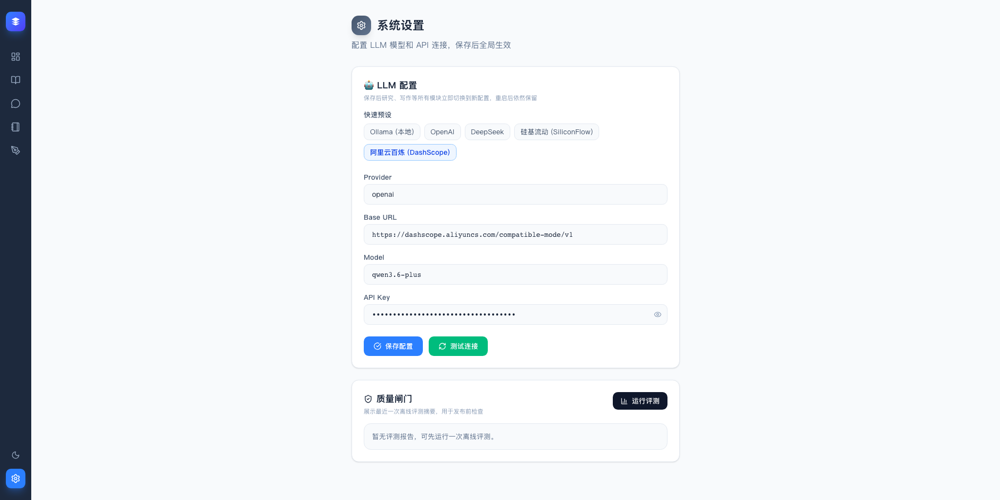

# 项目截图

## 总览页

主站首页展示当前系统的总览信息和核心功能入口。


## 知识库列表

知识库管理页展示现有知识库、文档数量和嵌入模型信息。



## 知识库详情

知识库详情页展示文档列表、文档分块信息和导入入口。



## 智能问答

聊天页展示基于知识库的回答、思考进度和引用证据。



## Notebook 列表

Notebook 入口页展示最近的研究工作区和创建入口。



## Notebook 工作区

Notebook 工作区展示来源筛选、问答区和笔记区的联动布局。



## 协同写作

协同写作页展示编辑器、目录结构和编译预览区。



## 系统设置

设置页展示 LLM 提供商、模型、接口地址和连通性测试入口。



## 更新方式

确保本地服务已经启动：

```bash
bash start_dev.sh
```

重新生成整组截图：

```bash
cd web && node ../scripts/capture_project_screenshots.mjs
```
