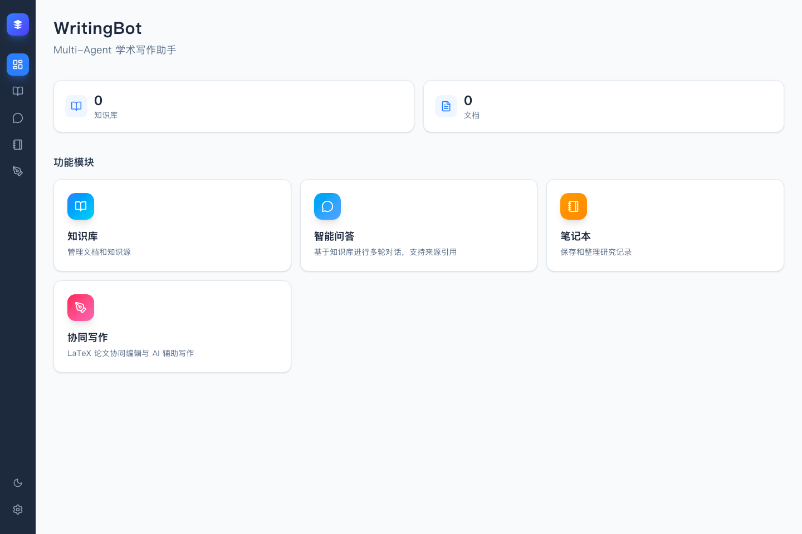

# 项目截图

## 总览页

当前主站总览页展示知识库数量、文档数量和核心功能入口。



## 截图更新方式

启动主前端：

```bash
cd web
npm run dev -- --hostname 127.0.0.1 --port 3000
```

生成总览页截图：

```bash
cd web
npx playwright screenshot --viewport-size=1440,960 http://127.0.0.1:3000 ../docs/assets/dashboard-overview.png
```

## 建议补充截图

后续在后端和本地数据准备完成后，可继续补充：

- 知识库列表与 PDF 导入页面。
- 智能问答页面的流式回答和来源引用。
- 笔记本工作区的来源、笔记和输出列。
- 协同写作页面的编辑器视图和 AI 辅助写作流程。
