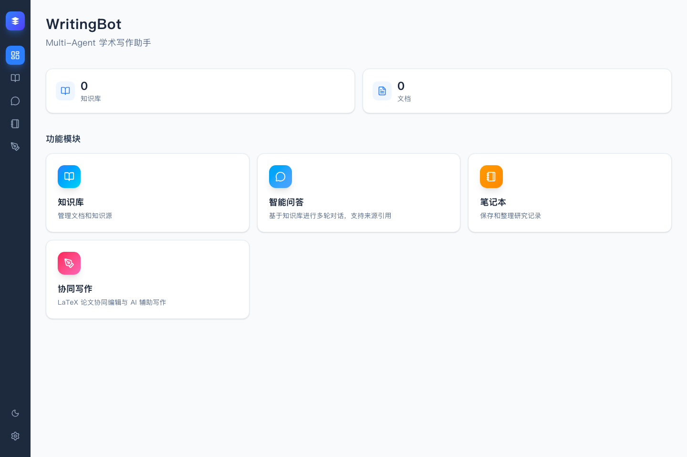
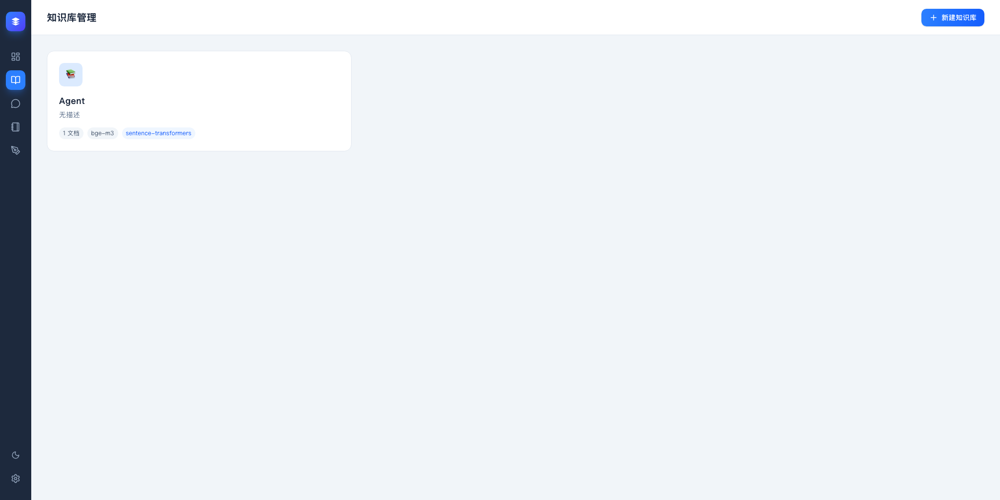
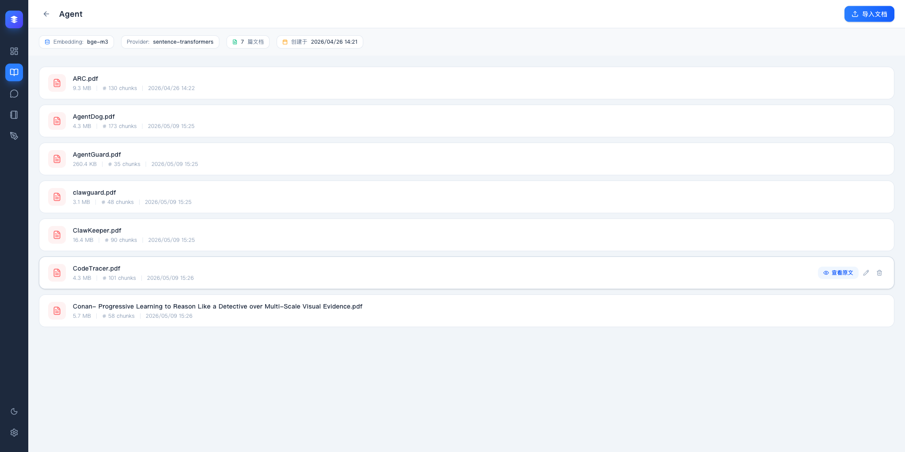
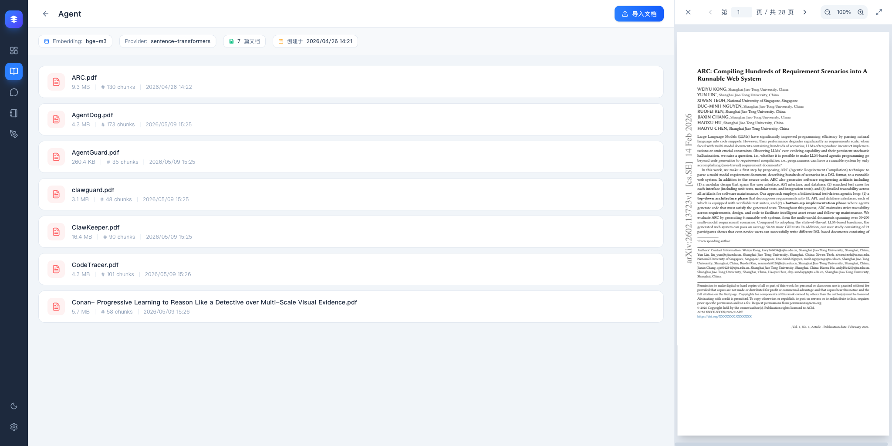
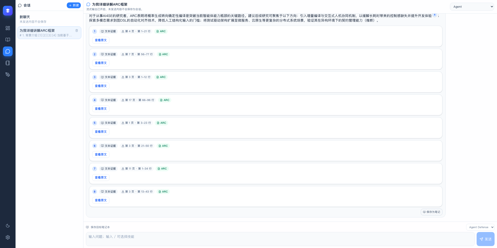
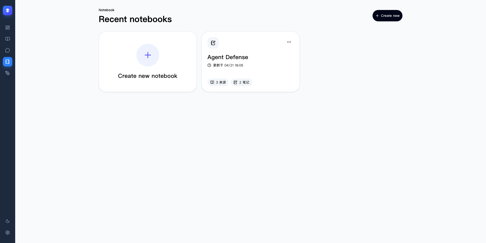
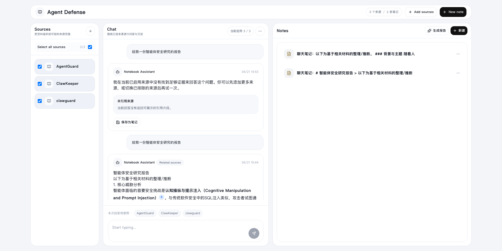
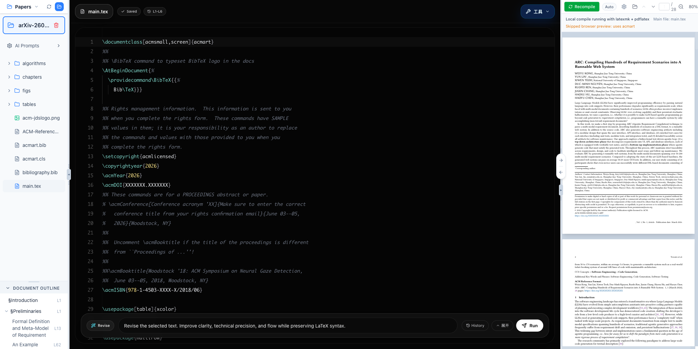
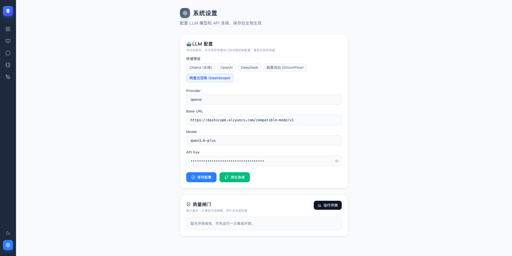

# 项目截图

本页按演示顺序整理当前可复现的主站截图，覆盖知识库、问答、Notebook、协同写作和系统设置等核心页面。

## 总览页

主站首页展示当前系统的总览信息和核心功能入口。



## 知识库列表

知识库管理页展示现有知识库、文档数量和嵌入模型信息。



## 知识库详情

知识库详情页展示知识库元信息、文档数量和当前导入的论文列表，适合用于说明知识库构建结果。



## 知识库预览

知识库详情页支持在右侧直接预览原始 PDF，方便演示文档导入、内容核查和页内浏览。



## 智能问答

聊天页展示基于知识库的回答、思考进度和引用证据。



## Notebook 列表

Notebook 入口页展示最近的研究工作区和创建入口。



## Notebook 工作区

Notebook 工作区展示来源筛选、问答区和笔记区的联动布局。



## Notebook 报告视图

Notebook 深入页展示来源选择、问答沉淀和笔记面板，适合说明研究归纳与报告生成链路。


## 协同写作

协同写作页展示项目文件树、LaTeX 编辑器和编译预览区，适合用于说明论文编辑与预览联动。



## 系统设置

设置页展示 LLM 提供商、模型、接口地址和连通性测试入口。



## 历史截图补充

为保留完整的功能覆盖，文档目录中仍保留一组此前生成的功能截图，可用于 README、答辩材料和历史版本对照：

- `assets/knowledge-detail.png`
- `assets/notebook-workspace.png`
- `assets/co-writer-workspace.png`
- `assets/settings-page.png`

## 更新方式

确保本地服务已经启动：

```bash
bash start_dev.sh
```

重新生成主站截图：

```bash
cd web && node ../scripts/capture_project_screenshots.mjs
```

如需补抓新的演示截图，可直接在本地运行页面后保存到 `docs/assets/`，并同步更新本页说明。
