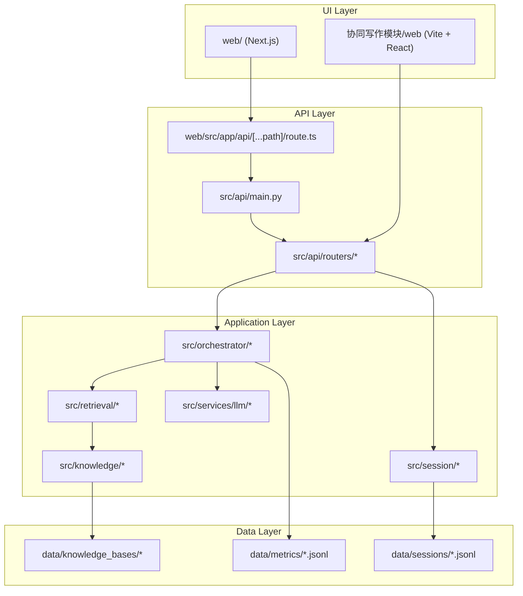
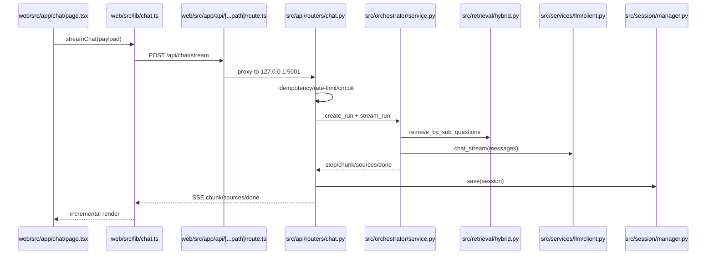
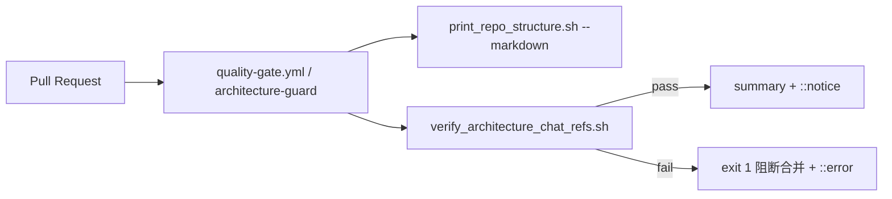

# WritingBot Architecture Onboarding

> 面向新人快速理解：先看目录层，再看 `api/chat` 运行时链路。

## 1) 目录结构层（Repository Map）

## 2) 运行时链路层（`api/chat` Critical Path）

## 3) 关键入口文件

- `src/api/main.py`：注册所有路由，`chat.router` 挂载入口。
- `src/api/routers/chat.py`：`/api/chat` 与 `/api/chat/stream`，含限流、熔断、幂等、SSE。
- `src/orchestrator/service.py`：`stream_run` 五阶段编排（plan/retrieve/synthesize/critique/finalize）。
- `src/retrieval/hybrid.py`：混合检索主入口 `retrieve_by_sub_questions`。
- `src/services/llm/client.py`：统一 LLM 同步/流式调用。
- `src/session/manager.py`：会话 JSONL 持久化。

## 4) 异常分支速览（`api/chat`）

| 分支 | 触发条件 | 返回行为 |
|---|---|---|
| Empty message | `message` 为空 | HTTP `400` |
| Rate limit | 10 秒窗口超额 | HTTP `429` |
| Circuit open | 连续失败触发熔断窗口 | HTTP `503` |
| Idempotency conflict | 同 key 不同 message | HTTP `409` |
| Inflight conflict | 同 key 请求并发中 | HTTP `409` |
| Stream fatal error | 编排/下游不可恢复异常 | SSE `error` + 会话写入失败消息 |

## 5) 新人推荐阅读顺序（30 分钟）

1. `docs/upgrade/repo-structure-overview.md`：先建立全局目录和主链路心智模型。
2. `src/api/main.py`：看路由装配。
3. `src/api/routers/chat.py`：看请求入口、异常分支和 SSE 输出。
4. `src/orchestrator/service.py`：看阶段执行与事件契约。
5. `src/retrieval/hybrid.py` + `src/services/llm/client.py` + `src/session/manager.py`：看下游依赖。
6. `docs/upgrade/architecture.md`：回到文档核对 `api/chat` 深挖图和时序节点。

## 6) 防漂移门禁（Doc vs Code）

- 结构快照：`scripts/print_repo_structure.sh --markdown`
- 架构锚点校验：`scripts/verify_architecture_chat_refs.sh`
- CI pre-merge：`.github/workflows/quality-gate.yml` 中 `architecture-guard` job（阻断）。
- 演练脚本：`scripts/simulate_arch_guard_ci.sh`（验证 `::notice` / `::error` 输出与失败非零退出码）。

