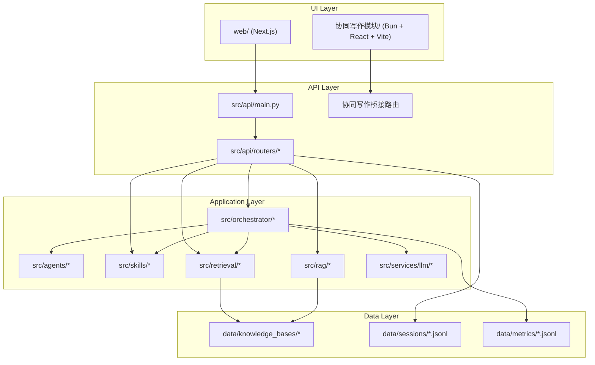
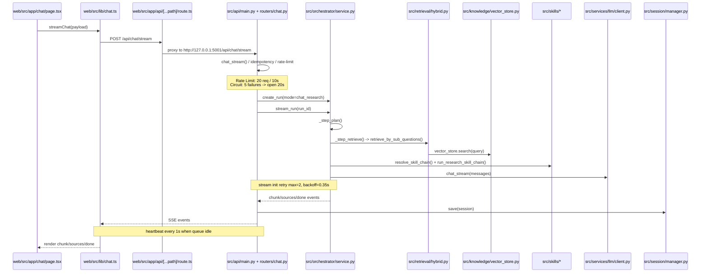
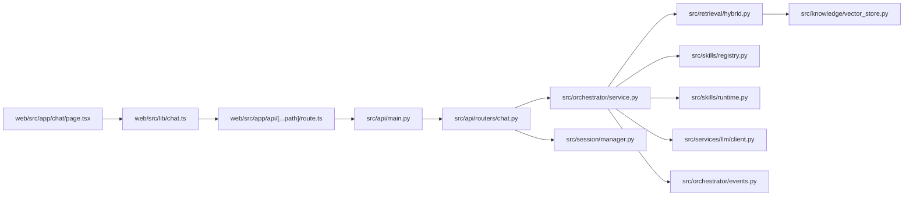
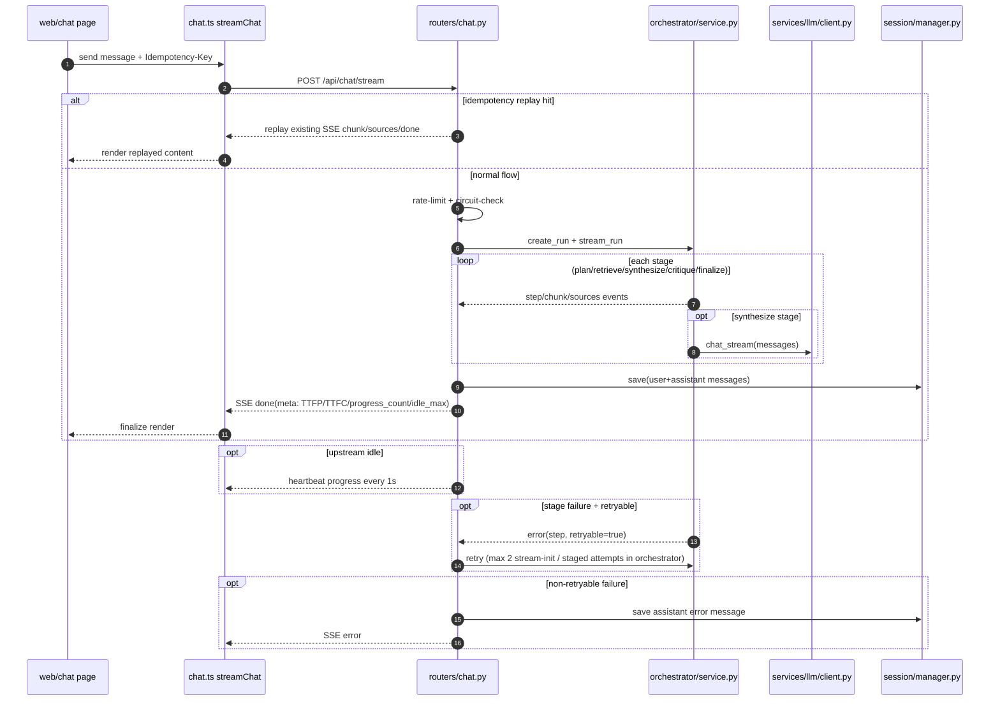
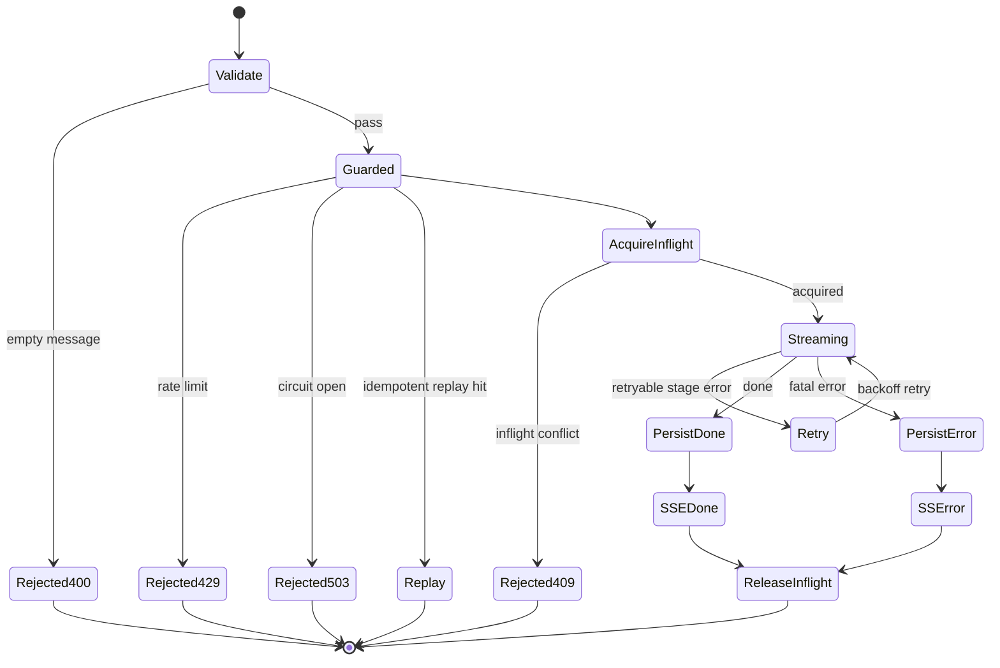

# WritingBot Upgrade Architecture

> Repository-level overview: see `docs/upgrade/repo-structure-overview.md`.
> This document focuses on deep runtime analysis for `api/chat`.

## 1) Directory Layer (Maintainable Module Boundaries)



## 2) Runtime Layer (`api/chat` Critical Path)



## 3) File-Level Call Flow (`/api/chat/stream`)

1. `web/src/app/chat/page.tsx`  
   `handleSend()` -> build request payload -> call `streamChat(...)`.
2. `web/src/lib/chat.ts`  
   `streamChat()` -> `fetch('/api/chat/stream')` -> parse SSE blocks.
3. `web/src/app/api/[...path]/route.ts`  
   wildcard proxy -> backend `/api/*`.
4. `src/api/main.py`  
   mounts `chat.router` with prefix `/api`.
5. `src/api/routers/chat.py`  
   `chat_stream()` -> `_resolve_session()` -> `_stream_orchestrator_with_retry()`.
6. `src/orchestrator/service.py`  
   `create_run()` -> `stream_run()` -> `_step_plan()` -> `_step_retrieve()` -> `_step_synthesize()` -> `_step_critique()` -> `_step_finalize()`.
7. `src/retrieval/hybrid.py` + `src/knowledge/vector_store.py`  
   hybrid recall (vector/BM25/graph) + rerank/judge/context; vector recall hits ChromaDB via `VectorStore.search()`.
8. `src/skills/registry.py` + `src/skills/runtime.py`  
   resolve selected research skills and derive synthesis directives.
9. `src/services/llm/client.py`  
   streaming completion (`chat_stream`) to configured OpenAI-compatible endpoint.
10. `src/session/manager.py`  
    persist messages to `data/sessions/*.jsonl`.

## 4) Orchestrator Event Contract

- `init`
- `step`
- `chunk`
- `sources`
- `metric`
- `error`
- `done`

## 5) Key Entry Points (File:Line)

- `src/api/main.py:96` -> `app.include_router(chat.router, prefix="/api", tags=["chat"])`
- `src/api/routers/chat.py:964` -> `async def chat_stream(...)`
- `src/api/routers/chat.py:580` -> `def _stream_orchestrator_with_retry(...)`
- `src/orchestrator/service.py:106` -> `def stream_run(...)`
- `src/orchestrator/service.py:364` -> `def _step_retrieve(...)`
- `src/orchestrator/service.py:419` -> `def _step_synthesize(...)`
- `src/retrieval/hybrid.py:244` -> `def retrieve_by_sub_questions(...)`
- `src/knowledge/vector_store.py:204` -> `def search(...)`
- `src/skills/registry.py:336` -> `def resolve_skill_chain(...)`
- `src/skills/runtime.py:12` -> `def run_research_skill_chain(...)`
- `src/services/llm/client.py:61` -> `def chat_stream(...)`
- `src/session/manager.py:123` -> `def save(...)`

## 6) `api/chat` Critical Timing Nodes

| Node | Meaning | Source |
|---|---|---|
| Rate Limit Window | 10 秒窗口，最多 20 次请求 | `src/api/routers/chat.py:45-46` |
| Circuit Breaker | 连续失败阈值 5，熔断打开 20 秒 | `src/api/routers/chat.py:47-48` |
| Stream Init Retry | 流启动最大重试 2 次 | `src/api/routers/chat.py:40` |
| Retry Backoff | 重试退避基准 0.35 秒（按 attempt 线性增） | `src/api/routers/chat.py:41` |
| LLM Timeout | 单次 LLM 调用超时 60 秒 | `src/api/routers/chat.py:42` |
| Heartbeat Tick | 队列空闲时每 1 秒推送进度心跳 | `src/api/routers/chat.py:43`, `:1155` |
| TTFP | `time_to_first_progress_ms`（首个进度事件耗时） | `src/api/routers/chat.py:612`, `:1216` |
| TTFC | `time_to_first_content_ms`（首个内容 chunk 耗时） | `src/api/routers/chat.py:613`, `:1217` |
| Progress Count | `progress_event_count`（总进度事件数） | `src/api/routers/chat.py:609`, `:1218` |
| Stream Idle Max | `stream_idle_max_s`（最大空闲间隔） | `src/api/routers/chat.py:616`, `:1219` |
| Fallback Chunk | `fallback_chunk_used`（done 输出回灌 chunk） | `src/api/routers/chat.py:611`, `:671`, `:1231` |

## 7) `api/chat` Runtime Dependency Graph (File-Level)



## 8) `api/chat` Timing-Aware Runtime (Happy Path + Failure Branch)



## 9) `api/chat` Node-to-Function Mapping (for Maintenance)

| Runtime node | Function | File |
|---|---|---|
| Request ingress | `chat_stream` | `src/api/routers/chat.py:964` |
| Idempotency replay lookup | `_find_idempotency_state` | `src/api/routers/chat.py` |
| Rate limit / circuit | `_enforce_rate_limit` / `_enforce_circuit` | `src/api/routers/chat.py` |
| Stream worker entry | `_stream_orchestrator_with_retry` | `src/api/routers/chat.py:580` |
| Run lifecycle | `create_run` / `stream_run` | `src/orchestrator/service.py:62`, `:106` |
| Retrieve stage | `_step_retrieve` | `src/orchestrator/service.py:364` |
| Hybrid retrieval | `retrieve_by_sub_questions` | `src/retrieval/hybrid.py:244` |
| Vector search | `search` | `src/knowledge/vector_store.py:204` |
| Skills resolution | `resolve_skill_chain` / `run_research_skill_chain` | `src/skills/registry.py:336`, `src/skills/runtime.py:12` |
| LLM stream | `chat_stream` | `src/services/llm/client.py:61` |
| Session persistence | `save` | `src/session/manager.py:123` |

## 10) `api/chat` Exception Branch Matrix (HTTP/SSE Behavior)

| Branch | Trigger | Behavior | Output channel | Persistence |
|---|---|---|---|---|
| Empty input | `message` 为空 | 直接拒绝 | HTTP `400` | 不写入会话 |
| Rate limited | 10 秒窗口超 20 次 | 拒绝请求 | HTTP `429` | 不写入会话 |
| Circuit open | 达到熔断阈值后窗口未恢复 | 拒绝请求 | HTTP `503` | 不写入会话 |
| Idempotency conflict | 同一 key 不同 message | 拒绝请求 | HTTP `409` | 不写入会话 |
| Inflight conflict | 同 key 请求并发进行中 | 拒绝请求 | HTTP `409` | 不写入会话 |
| Idempotency replay | 同 key 已有 assistant 结果 | 直接回放历史响应 | SSE `chunk/sources/done` | 不新增消息 |
| Orchestrator stage error (retryable) | 编排阶段异常且可重试 | 记录错误后重试 | SSE `step(retry)` + 后续事件 | 仅成功后落盘 |
| Orchestrator/worker fatal error | 重试失败或不可恢复异常 | 记录 `stream_error`，返回错误事件 | SSE `error` | 写入一条 assistant 错误消息 |
| Sync path uncaught error (`/chat`) | 编排或处理异常 | 统一包装失败响应 | HTTP `500` | 由执行进度决定（通常保留已有 user 消息） |

### 10.1) Retry / Degrade Branch Matrix (`api/chat`)

| Branch type | Trigger | Retry policy | Degrade behavior | Observability |
|---|---|---|---|---|
| Sync call retry | `/api/chat` 执行编排超时或异常 | `_NON_STREAM_RETRY_ATTEMPTS=2`，`_execute_with_retry` + 退避 | 无降级输出；最终转 HTTP `500` | `sync_retry` 审计事件 + `retries_total` 计数 |
| Stream init retry (RAG/LLM/Orchestrator) | 流初始化失败且尚未产生内容 | `_STREAM_INIT_RETRY_ATTEMPTS=2`，线性 backoff | 若超过重试上限，进入 SSE `error` 分支 | `stream_retry` 审计事件 + `retries_total` |
| Orchestrator stage retry | `stream_run` 阶段事件返回 `retryable=true` | 阶段内重试（最多 3 次） | 阶段成功则继续；不可恢复则写入错误消息并返回 SSE `error` | `step(retry)` 进度事件 + `stream_error` 审计 |
| Heartbeat degrade | 上游事件短时空闲 | 非错误路径，无额外重试 | 每 1s 发送 progress heartbeat，避免前端“静默” | `stream_heartbeat_progress_total` + `stream_diag` |
| Done-output fallback degrade | `done.output` 存在但无内容 chunk | 非错误路径 | 把最终 output 切片回灌为 chunk（`fallback_chunk_used=true`） | `stream_fallback_chunk_total` + `stream_diag` |
| Idempotency replay shortcut | 同 key 已存在 assistant 响应 | 不进入新执行 | 直接回放已持久化结果（SSE `chunk/sources/done`） | `idempotent_replay_total` + replay 审计事件 |

## 11) `api/chat/stream` Error-State Diagram



## 12) Drift Guard (Doc <-> Code)

- Script: `scripts/verify_architecture_chat_refs.sh`
- Purpose:
  - 校验 `api/chat` 主链路关键函数在源码中仍存在
  - 校验文档仍引用这些关键文件（防止架构文档漂移）
- Run:

```bash
bash scripts/verify_architecture_chat_refs.sh
```
