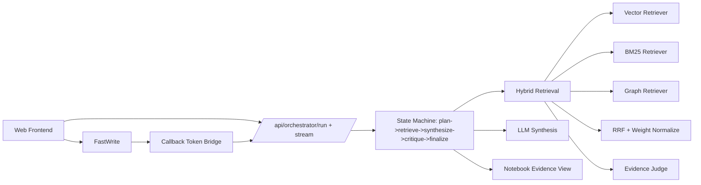

# WritingBot Upgrade Architecture

## Runtime Topology

```mermaid
flowchart LR
  FE[Web Frontend] --> ORCH[/api/orchestrator/run + stream/]
  ORCH --> FSM[State Machine: plan->retrieve->synthesize->critique->finalize]
  FSM --> RET[Hybrid Retrieval]
  RET --> VEC[Vector Retriever]
  RET --> BM25[BM25 Retriever]
  RET --> GRA[Graph Retriever]
  RET --> FUSION[RRF + Weight Normalize]
  RET --> JUDGE[Evidence Judge]
  FSM --> LLM[LLM Synthesis]
  FSM --> NOTE[Notebook Evidence View]
  FE --> FW[FastWrite]
  FW --> BRIDGE[Callback Token Bridge]
  BRIDGE --> ORCH
```

## Orchestrator Event Contract

- `init`
- `step`
- `chunk`
- `sources`
- `metric`
- `error`
- `done`
