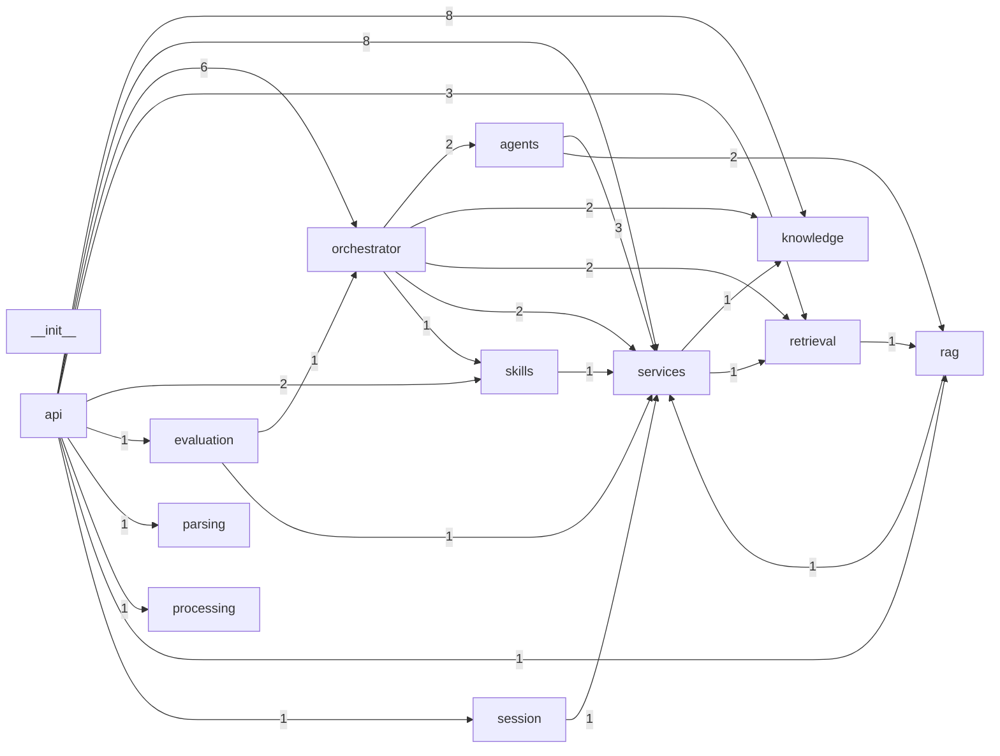

# Module Dependency Graph

Generated at: 2026-03-16T18:15:44.114715

## Summary

- packages: `13`
- dependency_edges: `25`
- detected_cycle_scc: `1`
- baseline_cycle_scc: `1`
- new_cycle_scc: `0`
- resolved_cycle_scc: `0`

## Cross-Module Dependency Graph (package-level)

## Top Cross-Module Edges

| Edge | Count |
|---|---:|
| `api -> knowledge` | 8 |
| `api -> services` | 8 |
| `api -> orchestrator` | 6 |
| `agents -> services` | 3 |
| `api -> retrieval` | 3 |
| `agents -> rag` | 2 |
| `api -> skills` | 2 |
| `orchestrator -> agents` | 2 |
| `orchestrator -> knowledge` | 2 |
| `orchestrator -> retrieval` | 2 |
| `orchestrator -> services` | 2 |
| `api -> evaluation` | 1 |
| `api -> parsing` | 1 |
| `api -> processing` | 1 |
| `api -> rag` | 1 |
| `api -> session` | 1 |
| `evaluation -> orchestrator` | 1 |
| `evaluation -> services` | 1 |
| `orchestrator -> skills` | 1 |
| `rag -> services` | 1 |

## Cycle Report

- [KNOWN] `rag <-> retrieval <-> services`
