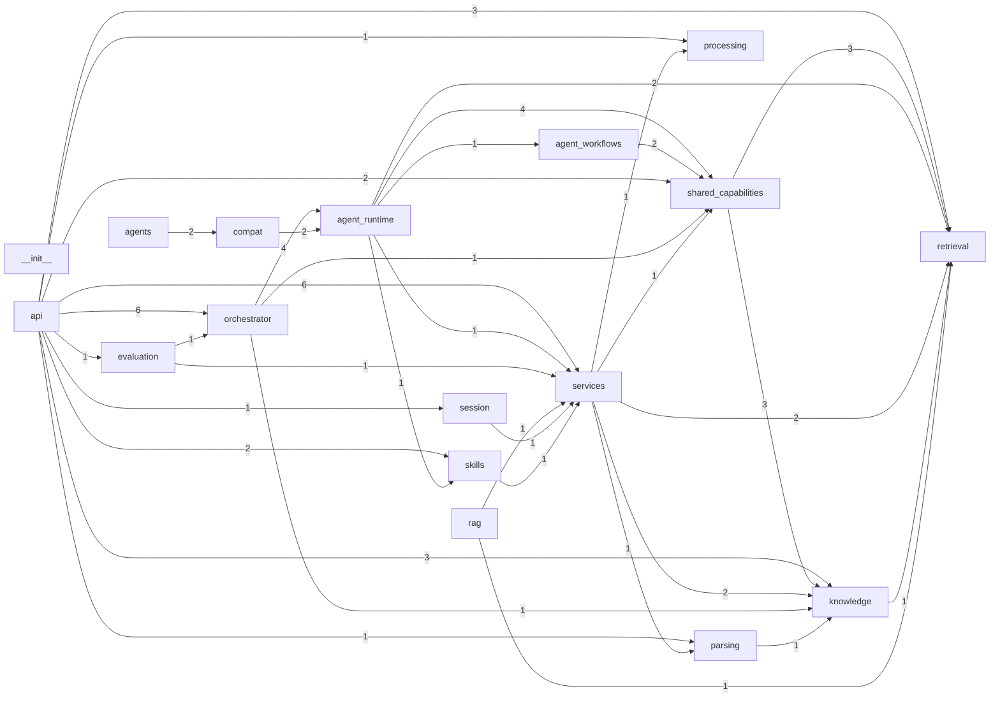

# Module Dependency Graph

Generated at: 2026-05-17T20:45:23.643105

## Summary

- packages: `17`
- dependency_edges: `36`
- detected_cycle_scc: `0`
- baseline_cycle_scc: `0`
- new_cycle_scc: `0`
- resolved_cycle_scc: `0`

## Cross-Module Dependency Graph (package-level)

```mermaid
flowchart LR
  __INIT__["__init__"]
  AGENT_RUNTIME["agent_runtime"]
  AGENT_WORKFLOWS["agent_workflows"]
  AGENTS["agents"]
  API["api"]
  COMPAT["compat"]
  EVALUATION["evaluation"]
  KNOWLEDGE["knowledge"]
  ORCHESTRATOR["orchestrator"]
  PARSING["parsing"]
  PROCESSING["processing"]
  RAG["rag"]
  RETRIEVAL["retrieval"]
  SERVICES["services"]
  SESSION["session"]
  SHARED_CAPABILITIES["shared_capabilities"]
  SKILLS["skills"]
  API -->|6| ORCHESTRATOR
  API -->|6| SERVICES
  AGENT_RUNTIME -->|4| SHARED_CAPABILITIES
  ORCHESTRATOR -->|4| AGENT_RUNTIME
  API -->|3| KNOWLEDGE
  API -->|3| RETRIEVAL
  SHARED_CAPABILITIES -->|3| KNOWLEDGE
  SHARED_CAPABILITIES -->|3| RETRIEVAL
  AGENT_RUNTIME -->|2| RETRIEVAL
  AGENT_WORKFLOWS -->|2| SHARED_CAPABILITIES
  AGENTS -->|2| COMPAT
  API -->|2| SHARED_CAPABILITIES
  API -->|2| SKILLS
  COMPAT -->|2| AGENT_RUNTIME
  SERVICES -->|2| KNOWLEDGE
  SERVICES -->|2| RETRIEVAL
  AGENT_RUNTIME -->|1| AGENT_WORKFLOWS
  AGENT_RUNTIME -->|1| SERVICES
  AGENT_RUNTIME -->|1| SKILLS
  API -->|1| EVALUATION
  API -->|1| PARSING
  API -->|1| PROCESSING
  API -->|1| SESSION
  EVALUATION -->|1| ORCHESTRATOR
  EVALUATION -->|1| SERVICES
  KNOWLEDGE -->|1| RETRIEVAL
  ORCHESTRATOR -->|1| KNOWLEDGE
  ORCHESTRATOR -->|1| SHARED_CAPABILITIES
  PARSING -->|1| KNOWLEDGE
  RAG -->|1| RETRIEVAL
  RAG -->|1| SERVICES
  SERVICES -->|1| PARSING
  SERVICES -->|1| PROCESSING
  SERVICES -->|1| SHARED_CAPABILITIES
  SESSION -->|1| SERVICES
  SKILLS -->|1| SERVICES
```

## Top Cross-Module Edges

| Edge | Count |
|---|---:|
| `api -> orchestrator` | 6 |
| `api -> services` | 6 |
| `agent_runtime -> shared_capabilities` | 4 |
| `orchestrator -> agent_runtime` | 4 |
| `api -> knowledge` | 3 |
| `api -> retrieval` | 3 |
| `shared_capabilities -> knowledge` | 3 |
| `shared_capabilities -> retrieval` | 3 |
| `agent_runtime -> retrieval` | 2 |
| `agent_workflows -> shared_capabilities` | 2 |
| `agents -> compat` | 2 |
| `api -> shared_capabilities` | 2 |
| `api -> skills` | 2 |
| `compat -> agent_runtime` | 2 |
| `services -> knowledge` | 2 |
| `services -> retrieval` | 2 |
| `agent_runtime -> agent_workflows` | 1 |
| `agent_runtime -> services` | 1 |
| `agent_runtime -> skills` | 1 |
| `api -> evaluation` | 1 |

## Cycle Report

- No cycle detected.
