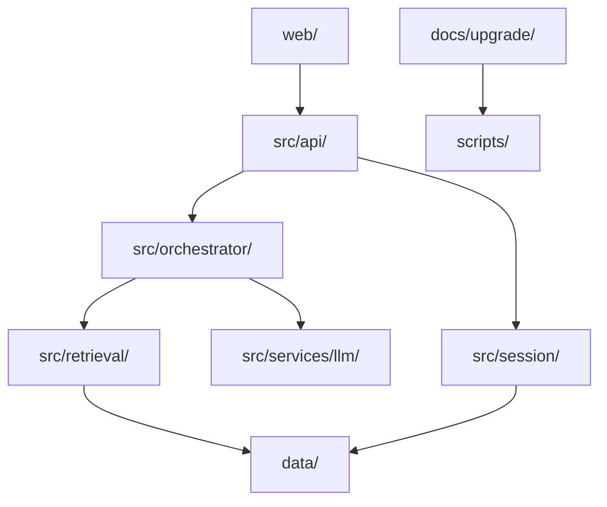
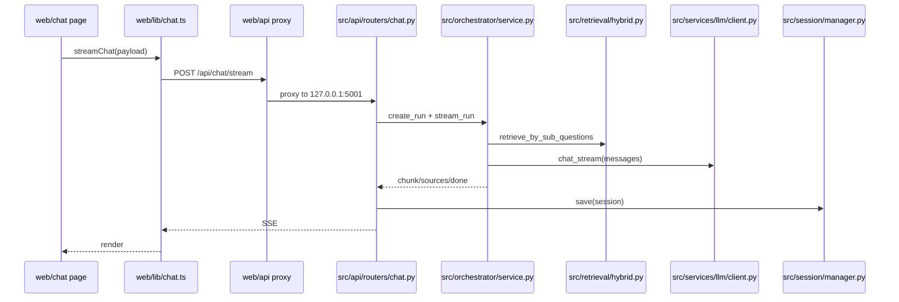

# Project Structure Brief

> 一页看懂 WritingBot：目录结构、运行时链路、关键入口。

## 1) 根目录关键项

| Path | 作用 |
|---|---|
| `src/` | Python 后端主代码（API/编排/检索/会话/LLM/技能） |
| `web/` | Next.js 前端与 API 代理 |
| `FastWrite/` | 论文编辑子系统（独立前后端） |
| `config/` | 配置 |
| `data/` | 运行数据（knowledge_bases/sessions/metrics 等） |
| `docs/upgrade/` | 架构、演练、升级文档 |
| `scripts/` | 结构快照/架构锚点校验/CI 演练脚本 |
| `tests/` | 测试 |
| `start_dev.sh` | 一键启动脚本（5001/3000/3003/3002） |
| `main.py` | CLI 入口 |
| `server.py` | 旧 Flask 入口（兼容） |

## 2) 双层架构图

### 2.1 目录结构层



### 2.2 运行时链路层（Web Chat）



## 3) 运行时主链路（文本版）

```text
web/src/app/chat/page.tsx
  -> web/src/lib/chat.ts (streamChat)
  -> web/src/app/api/[...path]/route.ts (proxy)
  -> src/api/main.py (router mount)
  -> src/api/routers/chat.py (chat_stream)
  -> src/orchestrator/service.py (stream_run)
  -> src/retrieval/hybrid.py + src/services/llm/client.py
  -> src/session/manager.py (save)
  -> SSE back to frontend
```

## 4) 关键入口

- API 入口：`src/api/main.py`
- Chat 入口：`src/api/routers/chat.py`
- 前端代理入口：`web/src/app/api/[...path]/route.ts`
- 本地统一启动：`start_dev.sh`

## 5) CI 与架构文档入口

- pre-merge CI：`.github/workflows/quality-gate.yml`
- 结构快照脚本：`scripts/print_repo_structure.sh`
- 架构锚点校验：`scripts/verify_architecture_chat_refs.sh`
- PR 演练脚本：`scripts/rehearse_arch_guard_pr.sh`
- 新人双层架构图：`docs/upgrade/architecture-onboarding.md`
- 仓库级总览：`docs/upgrade/repo-structure-overview.md`
- `api/chat` 深挖：`docs/upgrade/architecture.md`

## 6) 跨模块依赖可视化与循环依赖守卫

- 依赖图文档：`docs/upgrade/module-dependency-graph.md`
- 守卫脚本：`scripts/generate_module_dependency_graph.py`
- 循环依赖基线：`config/dependency-cycles-baseline.txt`
- 本地演练：`scripts/simulate_dependency_guard_ci.sh`
- 全链路演练：`scripts/simulate_full_guard_ci.sh`
