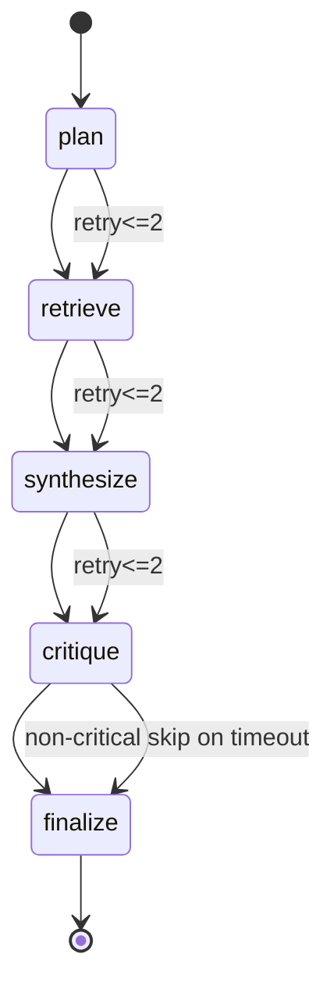

# Orchestrator State Machine

```mermaid
stateDiagram-v2
  [*] --> plan
  plan --> retrieve
  retrieve --> synthesize
  synthesize --> critique
  critique --> finalize
  finalize --> [*]

  plan --> retrieve: retry<=2
  retrieve --> synthesize: retry<=2
  synthesize --> critique: retry<=2
  critique --> finalize: non-critical skip on timeout
```

## Retry & Degrade

- 每个步骤最多重试 2 次（共 3 次尝试）。
- `critique` 为非关键步骤，连续失败后 `skipped`。
- 关键步骤失败则 run 终止并输出 `error`。
